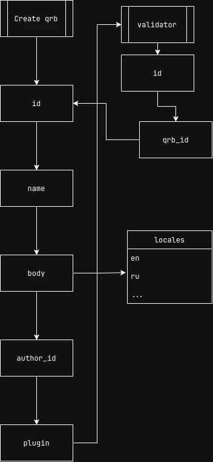

# QRB Plugins

Пример плагина валидатора



Для создания плагина необходимо 
модуль для подключения плагинов на фронт и бэк.
В package создается cli tool `ash-cli`.
Для установки плагина необходимо скачать плагин из npm 

```shell
bunx run plugin-install <npm-package-name>
```

Или ручной устоновкой через добавление 
в `packages/ash-cli/plugins` и командой запустить установку

```shell
bunx run plugin-install
```

## Структура плагина

Для создания требуется создать package через vite

```shell
vite create ash-plugin
```

Плагин должен позволять расширять функционал всех приложений из `/app`
Плагин собирается и отправляется
